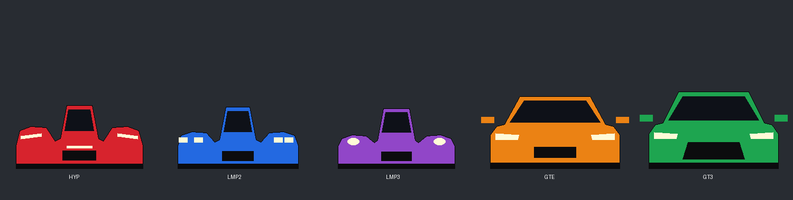
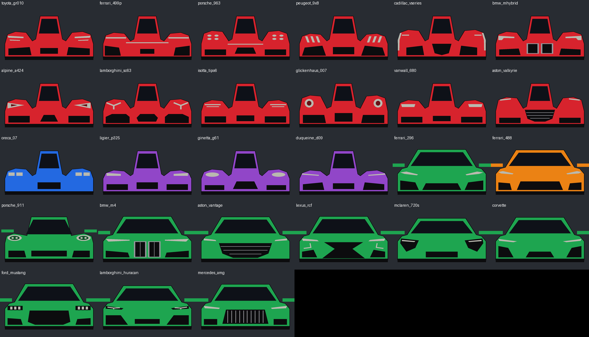

# AviX Mirror — rétroviseur VoCore pour Le Mans Ultimate et Assetto Corsa

Application Windows qui affiche le rétroviseur de **Le Mans Ultimate (LMU)** et d'**Assetto Corsa** sur un écran
**VoCore 7,8″ (1280×400)** monté comme un vrai rétroviseur, **sans que le rétro virtuel reste
affiché sur l'écran principal**.

## Interface

Fenêtre sombre aux couleurs d'AVIX_3D : choix du mode par tuiles, gros bouton **DÉMARRER**, aperçu en
direct de l'image envoyée au VoCore, état détaillé et réglages avancés. La **couleur d'accent** et la
**police** se changent dans *8. Apparence* (effet immédiat). Au démarrage, le VoCore affiche un écran
d'accueil AVIX_3D en attendant les images du jeu.

## ATH façon caméra de recul (Bosch)

Dans les trois modes (Radar, Caméra AC, Capture LMU), un ATH inspiré des caméras de recul Bosch
Motorsport s'affiche par-dessus l'image :

- **Flèche au-dessus de chaque voiture derrière**, colorée selon l'écart en temps : vert au-delà
  d'1 s, orange entre 0,5 et 1 s, rouge en dessous. Taille réglable (*Taille des flèches (%)*).
- **Échelle de distance à gauche et de temps à droite**, fixes, sur toute la hauteur de l'écran et
  découpées en 10 graduations égales (par défaut 0–100 m par pas de 10 m et 0–2 s par pas de 0,2 s,
  réglables), affichées en miroir (réglage « Échelles en miroir »). Un repère coloré montre l'écart de chaque voiture sur les deux échelles.

En Caméra AC, l'ATH utilise exactement le point de vue de la caméra. En Capture LMU, le point de vue du
rétro virtuel du jeu est approché : ajustez *6. ATH caméra de recul* (champ de vision, hauteur, position)
si les flèches sont décalées, et *Inverser gauche/droite des flèches* si elles sont du mauvais côté.

## LEDs spotter (WS2812B sur la carte MPro)

Deux barrettes de 8 LEDs WS2812B, une de chaque côté de l'écran, branchées en série sur la carte MPro
du VoCore (droite puis gauche). AviX Mirror les pilote par le même câble USB que l'image, avec le
protocole I2C de VoCore (contrôleur de LEDs à l'adresse `0x74`, compatible IS31FL3731,
cf. [Vonger/V7B_WS2812B](https://github.com/Vonger/V7B_WS2812B)).

| Situation | LEDs du côté concerné |
|-----------|------------------------|
| Voiture qui arrive derrière, à moins de 25 m | jaune → orange, de plus en plus de LEDs allumées |
| Voiture à côté de vous | toutes rouges |
| Voitures des deux côtés (sandwich) | rouge clignotant des deux côtés |

Fonctionne dans tous les modes (Radar, Caméra AC, Capture), avec LMU et Assetto Corsa. Au branchement,
les LEDs s'allument une par une dans l'ordre de la chaîne (couleur AVIX) : vérifiez que la droite
s'allume en premier, et utilisez *Inverser le sens* si une barrette se remplit à l'envers. Réglages
dans *7. LEDs spotter* (luminosité, distance d'alerte, ordre de câblage, protocole). L'aperçu de la
fenêtre montre l'état des LEDs de chaque côté du rétro.

Quand aucun jeu ne tourne, le VoCore affiche la page de veille avec le logo AVIX.

## Compatible Easy Anti-Cheat

- **Aucun pilote d'écran VoCore n'est nécessaire.** AviX Mirror envoie l'image au VoCore **en USB**,
  exactement comme SimHub, avec le pilote USB déjà installé par SimHub. Le pilote
  d’« écran Windows » du VoCore est **à désinstaller** : c’est la cause la plus probable de l’erreur
  Easy Anti-Cheat **30007** (« Driver Signature Enforcement »).
- AviX Mirror ne lit ni n'écrit jamais la mémoire du jeu et n'injecte rien. En mode Capture, il
  attend **30 s** après l'apparition de LMU (réglable) avant de capturer sa fenêtre, pour laisser
  Easy Anti-Cheat démarrer.
- Le mode **Radar** ne touche pas du tout au jeu : il lit seulement la télémétrie partagée,
  comme SimHub ou CrewChief.

### Désinstaller le pilote d'écran VoCore (si vous l'aviez installé)

1. *Gestionnaire de périphériques* → *Cartes graphiques* (ou *Écrans*) → entrée **VoCore** →
   clic droit → **Désinstaller l'appareil** → cochez « Tenter de supprimer le pilote » → OK.
2. Redémarrez.
3. Rebranchez le VoCore et vérifiez qu'il fonctionne toujours dans SimHub : il utilise alors son
   pilote USB normal. AviX Mirror utilise ce même pilote.

## Les modes

| Mode | Principe |
|------|----------|
| **Radar** (recommandé) | Rétro synthétique dessiné depuis la télémétrie : les voitures derrière vous en perspective, avec **la silhouette et la couleur de leur catégorie**, la distance, la vitesse de rapprochement et une alerte de voiture à côté. Ne touche pas au jeu, rien ne s'affiche sur l'écran principal. |
| **Caméra Assetto Corsa** | Vraie vue arrière rendue hors écran par Assetto Corsa (app Lua CSP). Rien ne s'affiche sur l'écran du jeu. |
| **Capture LMU** | La vraie image du rétro virtuel de LMU, lue dans la fenêtre du jeu et envoyée au VoCore. Un **cache** est posé sur le rétro de l'écran principal. |

Dans tous les cas, l'image part **en USB vers le VoCore**, avec son pilote USB : pas de second écran Windows.

## Pré-requis

1. Windows 10 version 2004 ou plus récent (Windows 11 conseillé : pas de cadre jaune autour du jeu capturé).
2. Le VoCore **branché en USB et fonctionnel dans SimHub** (pilote USB VoCore).
   **Fermez SimHub, ou désactivez-y le VoCore, pendant qu'AviX Mirror tourne** : un seul
   logiciel à la fois peut piloter l'écran.
3. Mode **Radar** : le plugin rF2 Shared Memory Map actif dans LMU (SimHub l'installe :
   `Le Mans Ultimate\Plugins\rFactor2SharedMemoryMapPlugin64.dll`).

## Installation

Téléchargez l'artefact `AviXMirror-win-x64` depuis l'onglet **Actions** du dépôt GitHub (ou
**Releases**). Dézippez-le dans un dossier : **gardez `libusb-1.0.dll` à côté de `AviXMirror.exe`**.
Les réglages sont enregistrés dans `AviXMirror.settings.json`, dans le même dossier.

## Mode Radar

Mode **Radar**, puis **Démarrer**. Aucune autre configuration.



| Catégorie | Couleur | Silhouette (vue de face) |
|-----------|---------|--------------------------|
| Hypercar | rouge | proto large et bas, ailes très bombées, fines barres LED |
| LMP2 | bleu | proto, doubles petits phares rectangulaires dans les ailes |
| LMP3 | violet | proto plus petit, un phare rond par aile |
| GTE | orange | voiture de route, petite calandre, rétroviseurs |
| GT3 | vert | voiture de route plus haute, grande calandre trapézoïdale, rétroviseurs |

**Face avant par voiture (LMU).** Dans Le Mans Ultimate, chaque voiture reconnue a sa propre face
avant (phares, calandre, entrées d'air), la couleur restant celle de sa catégorie : Toyota GR010,
Ferrari 499P, Porsche 963, Peugeot 9X8, Cadillac V-Series.R, BMW M Hybrid V8, Alpine A424,
Lamborghini SC63, Isotta Fraschini Tipo 6, Glickenhaus 007, Vanwall 680, Aston Martin Valkyrie,
Oreca 07, Ligier JS P325, Ginetta G61, Duqueine D09, Ferrari 296 / 488, Porsche 911, BMW M4,
Aston Martin Vantage, Lexus RC F, McLaren 720S, Corvette, Ford Mustang, Lamborghini Huracán,
Mercedes-AMG. La voiture est reconnue par son nom dans LMU ; sinon la silhouette de sa catégorie est
utilisée. Réglage : *4. Radar › Face avant par voiture (LMU)*. Les formes sont décrites dans
`src/AviXMirror/Radar/CarFronts.txt`.



**La piste suit le circuit.** LMU ne fournit pas le tracé du circuit : AviX Mirror l'apprend
en direct à partir des positions de toutes les voitures (centre et largeur de la piste tous les 2 m).
Le statut indique la part du circuit déjà connue ; en course, quelques minutes suffisent. Le tracé
est ensuite **mémorisé par circuit** (`%LOCALAPPDATA%\AviXMirror\circuits`) et disponible
immédiatement aux sessions suivantes. La piste du rétro tourne alors dans les virages et suit le
relief, avec vibreurs rouge/blanc et lignes de bord ; tant que l'endroit n'est pas connu, une route
droite s'affiche.

**Vibreurs aux couleurs du circuit**, dessinés seulement dans les virages : jaune/bleu au Mans,
vert/blanc/rouge à Monza et Imola, rouge/jaune à Spa, blanc/vert/jaune à Interlagos, bleu/rouge au
Paul Ricard, noir/blanc à Silverstone, rouge/blanc/noir à Lusail, rouge/blanc ailleurs. Les couleurs sont dans `AviXMirror.kerbs.v2.json` (créé à côté de l'exe au premier
lancement) : chaque ligne associe un mot du nom du circuit à une suite de couleurs, que vous pouvez
modifier ou compléter, par exemple `"interlagos": ["#FFD700", "#009C3B"]`. Tous les circuits de LMU y
sont listés, DLC compris (WEC, ELMS, US Track Pass), ainsi que les principaux circuits d'Assetto Corsa.

**Fluidité** : LMU ne donne la position des voitures que 5 fois par seconde. Entre deux relevés,
AviX Mirror prolonge le mouvement (vitesse et rotation de la voiture) et corrige les écarts en douceur :
la vue tourne sans à-coups dans les virages.

Phares allumés : halo lumineux. Contour rouge : voiture à moins de 10 m. Bandeau orange sur un
bord : voiture à côté de vous. Si les voitures apparaissent du mauvais côté, activez
*Inverser gauche/droite*.

## Assetto Corsa (avec Content Manager)

La mémoire partagée officielle d'Assetto Corsa ne donne que **votre** voiture. AviX Mirror utilise donc
une petite app Lua pour **Custom Shaders Patch** (CSP, installé avec Content Manager) qui exporte la
position, la direction, la vitesse, la progression sur le tour et le modèle de **toutes** les voitures.

1. Dans Content Manager, vérifiez que **Custom Shaders Patch** est installé (*Paramètres > Custom Shaders Patch*).
2. Dans AviX Mirror, cliquez **Installer l'app Assetto Corsa** : elle est copiée dans
   `assettocorsa\apps\lua\AviXMirror` (dossier trouvé automatiquement dans Steam). Pour une installation
   manuelle, copiez le dossier `AssettoCorsa-app-CSP\AviXMirror` de l'archive au même endroit.
3. Mode **Radar**, *Jeu* = `Auto` (ou `AssettoCorsa`), puis **Démarrer**.
4. Lancez une session depuis Content Manager. L'app démarre toute seule (fenêtre « AviX Mirror »
   facultative dans la barre d'apps CSP).

La catégorie de chaque voiture (silhouette et couleur) est déduite de son identifiant AC : `gt3`,
`gte`, `lmp2`, `lmp3`, `919`, `499p`, `963`… Les autres voitures sont dessinées en gris. Le tracé du
circuit s'apprend comme dans LMU, puis il est mémorisé. Si les voitures apparaissent du mauvais côté,
activez *Assetto Corsa : inverser gauche/droite*.

## Assetto Corsa : vraie vue arrière, sans rétro virtuel

Mode **Caméra Assetto Corsa**. L'app Lua (même installation que ci-dessus) demande à Assetto Corsa
de rendre une **caméra arrière hors écran**, avec la même technique que l'intégration OBS de CSP.
L'image est partagée directement sur la carte graphique avec AviX Mirror, qui la retourne en
miroir et l'envoie au VoCore. **Rien n'est affiché sur l'écran du jeu.**

- Après une mise à jour d'AviX Mirror, recliquez **Installer l'app Assetto Corsa** (nouvelle version de l'app).
- Réglages (catégorie *5. Caméra Assetto Corsa*) : champ de vision, recul et hauteur de la caméra,
  résolution, images par seconde (30 par défaut), effet miroir, **exposition** et **gamma** (1 = neutre). Les réglages s'appliquent en direct pendant que vous roulez ;
  « Enregistrer les réglages » les conserve.
- Chaque image est un rendu supplémentaire de la scène : comptez une légère baisse de FPS, comme
  avec un rétroviseur en jeu. Baissez *Images par seconde* si besoin.
- Si l'arrière de votre voiture apparaît dans l'image, augmentez *Recul de la caméra*.
- L'image est rendue en HDR puis ramenée dans la plage de l'écran avec une **exposition automatique**
  et une courbe filmique : plus d'image blanche quand le ciel ou le soleil entre dans le champ.
  *Exposition* corrige cette exposition automatique (1 = neutre).
- La caméra s'arrête toute seule quand AviX Mirror est fermé.

## Mode Capture

1. **LMU** : *Paramètres > Affichage* → **Fenêtré** ou **Sans bordure** (pas le plein écran exclusif).
   Dans l'éditeur de HUD, placez le **rétro virtuel** dans un coin où il gêne peu (par exemple en haut, sur le toit).
2. **AviX Mirror** : mode **Capture LMU**, puis **Démarrer** (*Cacher le rétro du jeu* est activé par défaut).
3. Après le délai de 30 s qui suit le lancement de LMU, cliquez **Calibrer la zone**. Un cadre au
   format du VoCore (1280 × 400) couvre l'image : déplacez-le sur le rétro et réduisez-le par ses
   coins (le format est conservé), puis **Valider**.
4. Le rétro s'affiche sur le VoCore. Un cache le recouvre sur l'écran principal ; la capture
   n'est pas affectée, car elle lit la fenêtre du jeu et non l'écran. Le cache prend la couleur de
   l'image juste sous son bord (*Cache : couleur du décor*) et peut déborder de la zone de capture
   (*Cache : marge à gauche / droite / en haut / en bas*, dans *3. Capture LMU*).
5. Si l'image est à l'envers, réglez *Rotation* = `Rotation180`.

## Dépannage

| Symptôme | Solution |
|----------|----------|
| Easy Anti-Cheat erreur 30007 | Désinstallez le pilote d'**écran** VoCore (voir plus haut) et redémarrez. |
| « VoCore USB : écran introuvable ou occupé » | Fermez SimHub (ou désactivez-y le VoCore). Vérifiez dans le Gestionnaire de périphériques que l'ID matériel est `USB\VID_C872&PID_1004` ; sinon, reportez-le dans `VoCoreVendorId` / `VoCoreProductId` de `AviXMirror.settings.json` (réglages experts, masqués dans la fenêtre). |
| Image brouillée ou en biais sur le VoCore | Mauvaise résolution native : réglez `VoCoreWidth` / `VoCoreHeight` dans `AviXMirror.settings.json` (400 × 1280 ou 1280 × 400). |
| « En attente de Le Mans Ultimate » | Vérifiez `GameProcessName` (`Le Mans Ultimate`) dans `AviXMirror.settings.json`. |
| Image noire en mode Capture | LMU est en plein écran exclusif : passez en Fenêtré / Sans bordure. |
| Cadre jaune autour du jeu | Limitation de Windows 10. Il disparaît sous Windows 11. |
| Radar : « En attente de LMU » | Le plugin rF2 Shared Memory Map n'est pas activé. |
| Le cache est décalé | Refaites **Calibrer la zone** après avoir placé le rétro dans le HUD. |

## Structure du code

```
src/AviXMirror/
  Program.cs              point d'entrée
  MainForm.cs             fenêtre principale (tuiles de mode, aperçu VoCore, réglages)
  Ui/                     thème AVIX_3D, contrôles dessinés, écran d'accueil du VoCore
  MirrorEngine.cs         orchestration (recherche du jeu, capture/radar, sortie)
  MaskForm.cs             cache sur le rétro de l'écran principal
  CalibrationForm.cs      sélection de la zone du rétro à la souris
  Settings.cs             réglages (JSON)
  Capture/                capture LMU (Windows.Graphics.Capture), caméra Assetto Corsa, exposition HDR
  Hud/                    ATH façon caméra de recul (flèches, échelles)
  Output/                 envoi USB au VoCore (libusb, protocole du pilote officiel Vonger/mpro_drm)
  Radar/                  télémétrie LMU (rF2) et Assetto Corsa, tracé du circuit, vibreurs, rendu,
                          faces avant des voitures (CarFronts.txt), spotter à LEDs
  Util/                   Win32, tampon d'image, recherche de la fenêtre du jeu, installation de l'app AC
integrations/AssettoCorsa/AviXMirror/   app Lua pour Custom Shaders Patch (export de toutes les voitures)
```
